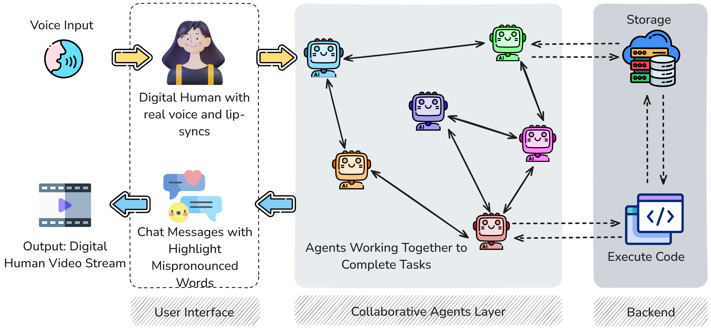
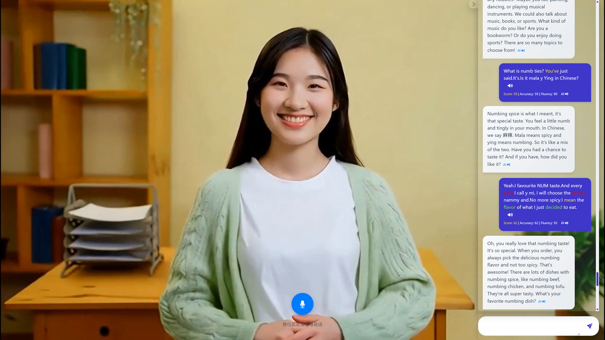
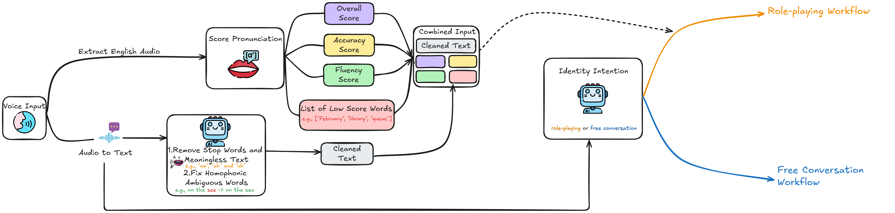
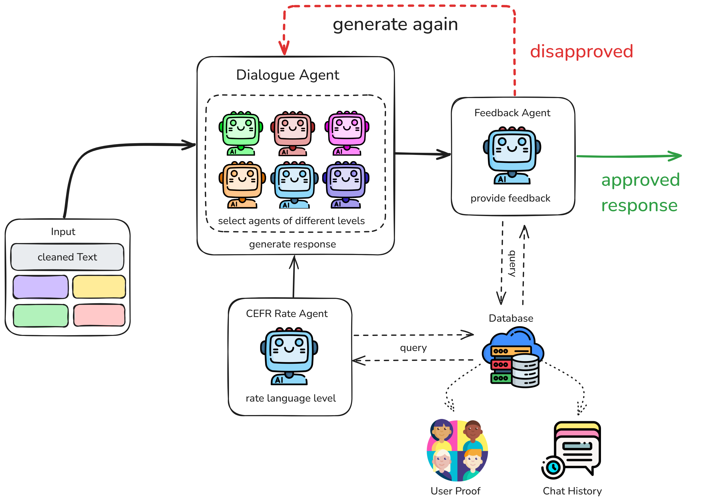
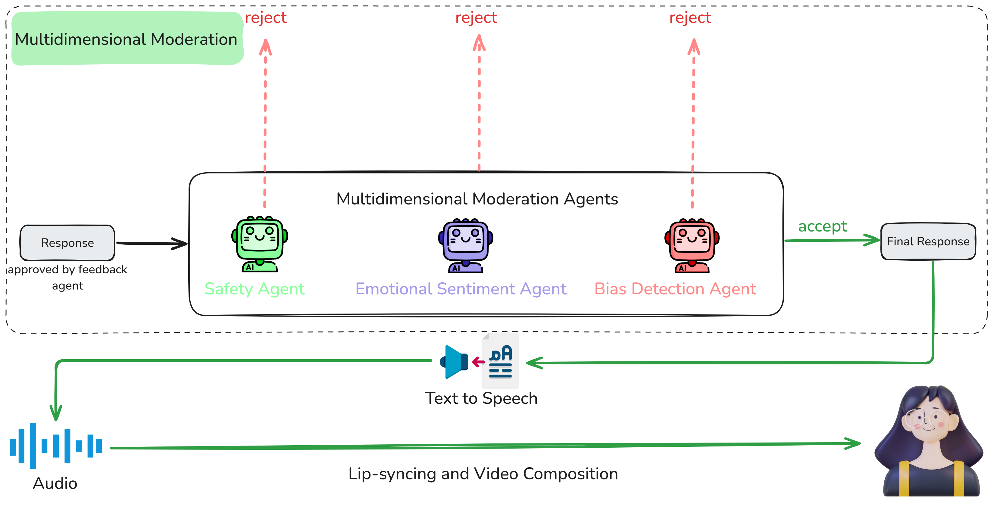

# Multi-Agent-Spoken

This repository contains the **frontend digital-human interface and related runtime glue** for the spoken EFL practice system described in our paper. It does **not** include the full intelligent-agent backend implementation; the multi-agent workflow in the paper was orchestrated separately.

The interface supports browser-based spoken interaction, WebRTC streaming, digital-human presentation, dialogue display, input handling, scoring display, and TTS/avatar integration for the experimental system.

## System Architecture

The paper studies a multi-agent AI system for English as a Foreign Language (EFL) speaking practice. The full research system combines a lightweight digital-human user interface, collaborative agents, and backend memory/data services. This repository corresponds to the **user-interface-facing implementation** used to present the digital human and support real-time spoken practice.

Figure 1 presents the complete layered system. The interface accepts voice or text and displays digital-human output. Collaborative agents coordinate dialogue tasks, while backend storage preserves conversation and learning records.



*Figure 1. Layered architecture of the multi-agent speaking practice system.*

## User Interface

The user interface was designed to reduce text-heavy interaction and make speaking practice feel more conversational. It uses a lightweight digital human, lip synchronization, mixed text/speech interaction, and pronunciation-related display cues.



*Figure 2. Digital-human user interface used in the study.*

## Agent Workflow

The following diagrams document the surrounding agent workflow evaluated in the paper. Their orchestration is outside this repository. The frontend works with these services to support hybrid Chinese-English input, contextual dialogue, and proficiency-adaptive feedback.

### Input Preprocessing

Speech input is transcribed, cleaned, and scored before it enters the dialogue workflow. The preprocessing agents remove disfluencies, correct ambiguous recognition results, and retain pronunciation evidence. An intent agent then selects role-playing or free conversation.



*Figure 3. Input preprocessing and workflow selection.*

### Response Generation

Dialogue agents are selected according to the learner's CEFR level. The feedback agent reviews each candidate response and returns unsuitable responses for regeneration. Conversation history and learner records provide context for later turns.



*Figure 4. Response generation and adaptive feedback loop.*

### Dialogue Supervision

Safety, emotional sentiment, and bias agents evaluate each response. Any rejection triggers another generation cycle. Approved responses proceed to text-to-speech and lip-synchronised digital-human output.



*Figure 5. Dialogue supervision and digital-human output.*


## Quick Start

### Linux

1. Configure the environment.

```bash
conda create -n nerfstream python=3.10
conda activate nerfstream
# If the CUDA version is not 11.3, install the matching PyTorch version from:
# https://pytorch.org/get-started/previous-versions/
conda install pytorch==1.12.1 torchvision==0.13.1 cudatoolkit=11.3 -c pytorch
pip install -r requirements.txt
```

2. Open required ports.

```bash
firewall-cmd --zone=public ---permanent -add-port=8010/tcp
firewall-cmd --zone=public ---permanent -add-port=1-65535/udp
```

3. Run the service.

```bash
python app.py --transport webrtc --model wav2lip --avatar_id wav2lip256_avatar5 --tts tencent --REF_FILE 101006 --customvideo_config data/custom_config.json
python app.py --transport webrtc --model wav2lip --avatar_id wav2lip256_avatar5 --tts tencent --REF_FILE 501009 --customvideo_config data/custom_config.json
```

4. Open the web pages.

```text
http://127.0.0.1:8010/login.html
http://127.0.0.1:8010/dashboard.html
```


## Acknowledgements

This frontend builds on [LiveTalking](https://github.com/lipku/LiveTalking).

## Citation

If you find this repository useful, please cite:

```bibtex
@article{multi2026zhang,
title ={Multi-agent vs. single-agent AI for EFL speaking practice: A controlled experiment with hybrid input, contextual dialogue, and proficiency-adaptive feedback},
author ={Jun Zhang and Qiwei Ma and Yu Zhang and Xiaoming Cao},
journal ={Educational Technology & Society},
volume ={29},
number ={2},
year ={2026},
month ={Apr},
pages ={297-322},
ISSN ={1176-3647},
publisher ={International Forum of Educational Technology & Society},
DOI ={10.30191/ETS.202604_29(2).SP05},
}
```
